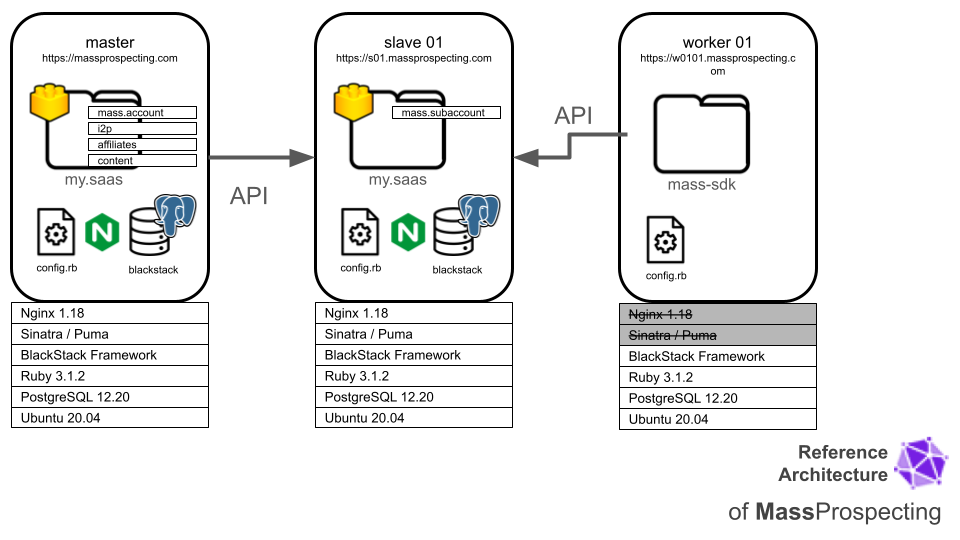

# ConnectionSphere Architecture

ConnectionSphere has 3 keys components:

1. the **master** node,
2. the **slave** nodes, and
3. the **worker** nodes.

The picture below shows the stack running on each one of them, and the communication between them too.

## 1. Master Node

The **master node** is the main server where users sign up, log in, and access the platform. There is only one master node running at any time. The master node performs several key functions:

- Hosts user accounts for the platform.
- Manages the marketplace for available profiles.
- Controls sub-accounts on **slave servers** (explained below).
- Handles invoicing and payment processing.
- Manages security, including login, logout, password reset, and recovery.

The master node runs a [my.saas](https://github.com/leandrosardi/my.saas) platform with the following extensions:

- [mass.commons](https://github.com/connection-sphere/mass.commons) _(private access)_
- [mass.account](https://github.com/connection-sphere/mass.account) _(private access)_
- [i2p](https://github.com/leandrosardi/i2p) (invoicing & payments processing)
- [content](https://github.com/leandrosardi/content) (a CMS)
- [monitoring](https://github.com/leandrosardi/monitoring)
- [dropbox-token-helper](https://github.com/leandrosardi/dropbox-token-helper)

The master node's `my.saas` platform uses a `config.rb` configuration file and runs its own local PostgreSQL database.

Users can create **sub-accounts** that are hosted on **slave nodes**.

## 2. Slave Nodes

The **slave nodes** are servers where sub-accounts are hosted. There can be one or more slave nodes running at any given time. A sub-account is used for:

- **White-labeling**: Creating a sub-account for each client of a user.
- **Cost Control**: Creating sub-accounts for different sectors within an organization.

Sub-accounts allow custom domains with the user's brand, and users can grant access to their clients.

The slave nodes also run a [my.saas](https://github.com/leandrosardi/my.saas) platform with the following extensions:

- [mass.commons](https://github.com/connection-sphere/mass.commons)
- [mass.subaccount](https://github.com/connection-sphere/mass.subaccount)

Each slave node has its own `config.rb` file and runs a local PostgreSQL database. Communication between the **master** and **slave** nodes is done via APIs.

## 3. Worker Nodes

The **worker nodes** handle tasks for each profile assigned to them, such as:

- Managing **LinkedIn** and **Facebook** profiles.
- Running **email verification** or **MTA outreach** processes.

Profiles are executed by the [mass-sdk](https://github.com/connection-sphere/mass-sdk). Communication between the mass-sdk and slave nodes is done via APIs.
